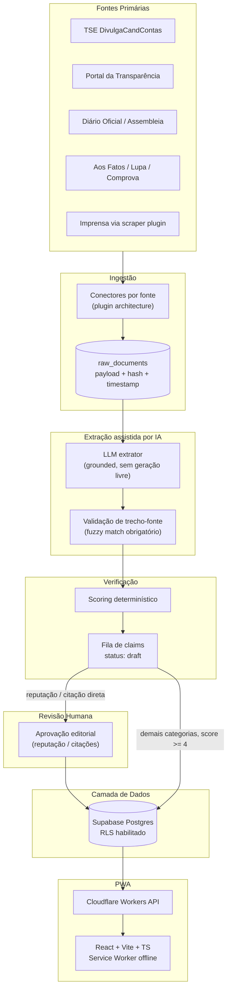

# Portal Transparência Eleitoral RS — Proposta de Arquitetura v2.0
### Revisão crítica e reengenharia da proposta original (agente de pesquisa + PWA)

**Data desta revisão:** 23/07/2026
**Autor:** Claude, atuando como engenheiro/arquiteto de software
**Entradas analisadas:** (1) spec do agente de pesquisa autônomo, (2) relatório diário de exemplo gerado por ele

---

## 0. Como li os documentos

Tratei os dois arquivos como entrada de auditoria — mesmo modelo que já rendeu bons resultados nos audits do `eventos-poa` e do `extrator-sympla`: primeiro reportar achados, depois propor mudanças, sem tocar em código até validação. Nenhuma das afirmações específicas do relatório de exemplo (nomes, partidos, números de pesquisa, citações) foi tratada como fato verificado — não tenho como confirmá-las, e esse é exatamente o ponto central desta revisão.

---

## 1. Diagnóstico da v1

### 1.1 O que a v1 acerta (manter na v2)

- Schema de dossiê bem pensado: identificação → histórico → plataforma → reputação → verificação.
- Ideia de score de confiança por afirmação (1–5).
- Regra explícita de **não omitir** dado não verificado — marcar `UNVERIFIED` em vez de esconder.
- Lista de fontes autorizadas sensata (TSE, Portal da Transparência, imprensa estabelecida, agências de fact-checking).
- Log diário de erro por fonte sem travar a execução inteira (circuit breaker implícito).
- Recorte de "histórico pessoal" restrito a relevância política clara — bom limite, evita virar dossiê pessoal.

### 1.2 Falha estrutural crítica — "verificação" que não verifica

O maior problema não é um bug, é o desenho do fluxo: o mesmo agente que gera a afirmação também decide sozinho que ela é "5 = Oficialmente Verificado". No relatório de exemplo isso aparece de forma nítida — citações diretas entre aspas, números de pesquisa com margem de erro, votações específicas, condecorações — tudo com score 5, mas **nenhum link, nenhum trecho de origem, nenhum timestamp de coleta**. Não há como um terceiro auditar de onde veio o dado.

Isso é mais perigoso que um dado claramente especulativo, porque carrega a credibilidade de "verificado" sem o lastro. Para conteúdo sobre pessoas públicas reais em processo eleitoral, esse é o tipo de coisa que não dá para "ajustar depois" — precisa ser impossível por construção.

### 1.3 Riscos legais e regulatórios

- **Difamação/responsabilidade civil:** a categoria "reputação & escrutínio" (acusações, escândalos, veredictos) é a mais sensível. Se uma afirmação errada for publicada como verificada, a responsabilidade civil recai sobre quem publica.
- **Regulação eleitoral sobre IA:** o TSE vem regulando, desde o ciclo de 2024, o uso de conteúdo sintético/gerado por IA em contexto de campanha (rotulagem, vedação a conteúdo que induza a erro sobre fatos ou atos de candidato). Não tenho como confirmar o texto vigente para o pleito de 2026 — isso precisa ser validado com assessoria jurídica eleitoral **antes do lançamento**, não é um detalhe de rodapé, é um bloqueador.
- **Direito de resposta:** a legislação eleitoral brasileira prevê direito de resposta para candidato atingido por afirmação que considere inverídica ou ofensiva — a v1 não tem mecanismo nenhum para isso.
- **LGPD:** o recorte de "relevância política clara" da v1 ajuda, mas o pipeline precisa impedir por design que dado sensível não-político entre no dossiê (não só evitar por instrução de prompt).

### 1.4 Riscos técnicos/operacionais

- "Pesquisa livre" via LLM sem grounding explícito tende a inventar nomes, números e datas — e calendário eleitoral muda toda semana (convenções, migrações partidárias, decisões do TRE).
- O schema tem `date_added` mas não versiona claims conflitantes — "correção" só existe na narrativa do prompt, não no modelo de dados.
- Log de erro em texto livre, não estruturado — não dá para montar dashboard de saúde do pipeline em cima disso.
- Nenhuma menção a rate limiting, custo de execução diária (chamadas de LLM + busca) ou resiliência de scraping — pontos que o `extrator-sympla` já te obrigou a mapear.

---

## 2. Princípios de redesenho (v2)

1. **Fonte antes de fluência.** Nenhuma claim entra em produção sem um artefato de origem citável (URL + trecho + timestamp de coleta).
2. **Confiança é calculada, não autoatribuída.** Score = função determinística de (tipo de fonte × nº de fontes independentes × concordância). Nunca "o modelo decidiu que é 5".
3. **Humano no loop para conteúdo sensível.** Toda claim em reputação/escrutínio ou toda citação direta passa por *approval gate* antes de virar pública.
4. **Imutabilidade e histórico.** Nada é sobrescrito. Toda correção gera nova versão com link para a anterior — e possibilidade de rollback.
5. **LLM como extrator, não como fonte.** O papel do modelo é estruturar texto já coletado, nunca gerar fato a partir do próprio conhecimento paramétrico.

---

## 3. Arquitetura de alto nível



---

## 4. Camada de ingestão

Substitui "pesquisa livre por LLM" por conectores estruturados — mesma lógica de plugin já usada no `extrator-sympla` (isolamento de falha por fonte, backoff, sem travar as demais):

- **TSE DivulgaCandContas** — dados oficiais de candidatura, bens, contas de campanha.
- **Portal da Transparência** — quando aplicável ao cargo/incumbente.
- **Diário Oficial / Assembleia Legislativa** — votações nominais de parlamentares em exercício.
- **Fact-checkers com API/RSS** (Aos Fatos, Agência Lupa, Comprova) quando disponível.
- **Imprensa** via scraping com plugin dedicado por veículo.

Cada conector grava o **payload bruto** (`raw_documents`) com hash e timestamp antes de qualquer processamento — trilha de auditoria a partir da origem, não do resumo.

---

## 5. Extração assistida por IA (grounded, não generativa)

Regras não-negociáveis para o extrator:

- Recebe **só** o texto já coletado em `raw_documents` — nunca gera "do zero" a partir do próprio conhecimento.
- Toda saída inclui `source_document_id` + `char_offset` de onde a informação foi extraída.
- Citação direta (aspas) só é aceita se casar literalmente (fuzzy match ≥ limiar) com um trecho no documento-fonte; se não casar, é **descartada automaticamente** — nunca "aproximada" ou parafraseada como se fosse literal.

```ts
function validateDirectQuote(quoteText: string, sourceDocument: string): boolean {
  const normalized = normalize(quoteText);
  return sourceDocument.includes(normalized) || fuzzyMatch(normalized, sourceDocument) > 0.92;
}
// se false: descarta a citação. Não existe "citação aproximada".
```

---

## 6. Scoring determinístico de confiança

```ts
function computeConfidenceScore(sources: SourceRef[]): number {
  const oficial = sources.filter(s => s.category === 'oficial');
  const factCheck = sources.filter(s => s.category === 'fact_check');
  const imprensa = sources.filter(s => s.category === 'imprensa');

  if (oficial.length >= 1 && (factCheck.length + imprensa.length) >= 1) return 5;
  if (oficial.length >= 1) return 4;
  if (imprensa.length >= 2) return 3;               // fontes de imprensa concordantes
  if (imprensa.length === 1 || factCheck.length === 1) return 2;
  return 1;                                          // detectado, não confirmado -> UNVERIFIED
}
```

O score nunca é uma saída do LLM — é calculado em código, sobre os registros estruturados de fonte. Isso preserva a boa ideia original (score 1–5, `UNVERIFIED` explícito) e remove o ponto cego (autoatribuição).

---

## 7. Fila editorial (approval gate)

- Toda claim nova em `reputation_scrutiny` ou toda citação direta nova entra em `status: pending_review` — não pode virar `published` sem uma linha em `editorial_reviews`.
- Painel de aprovação simples, dentro do mesmo PWA (`/admin`), com **Supabase Auth + RLS** restringindo por papel de editor — importante frisar isso porque em outro projeto seu já apareceu um painel admin acessível via bypass de `localStorage`; aqui a autenticação real precisa estar no banco (RLS), não no cliente.
- Log de quem aprovou, quando, e por quê (accountability e possibilidade de auditoria externa).
- Qualquer claim publicada pode ser **retratada** (`status: retracted`) mantendo o histórico — rollback sem apagar rastro.

---

## 8. Modelo de dados (esboço — Supabase/Postgres)

```sql
-- Candidatos (identidade básica, dado oficial)
create table candidates (
  id uuid primary key default gen_random_uuid(),
  full_name text not null,
  party text not null,
  ballot_number int,
  position text not null,           -- Governador, Senador, Deputado...
  tse_candidate_id text unique,     -- vínculo com registro oficial TSE
  created_at timestamptz default now()
);

-- Documentos brutos coletados (trilha de auditoria desde a origem)
create table raw_documents (
  id uuid primary key default gen_random_uuid(),
  source_name text not null,        -- 'TSE', 'GZH', 'Aos Fatos'...
  source_category text not null check (source_category in ('oficial','imprensa','fact_check','outro')),
  url text,
  content_hash text not null,
  raw_content text not null,
  fetched_at timestamptz not null default now()
);

-- Claims (fatos estruturados extraídos, versionados)
create table claims (
  id uuid primary key default gen_random_uuid(),
  candidate_id uuid references candidates(id),
  category text not null,           -- basic_identification | political_history | platform | reputation | quote
  content text not null,
  source_document_id uuid references raw_documents(id),
  source_char_offset int,
  confidence_score int not null check (confidence_score between 1 and 5),
  status text not null default 'draft'
    check (status in ('draft','pending_review','published','corrected','retracted')),
  previous_version_id uuid references claims(id),
  created_at timestamptz default now(),
  published_at timestamptz
);

-- Revisões editoriais (accountability)
create table editorial_reviews (
  id uuid primary key default gen_random_uuid(),
  claim_id uuid references claims(id),
  reviewer_id uuid references auth.users(id),
  decision text not null check (decision in ('approved','rejected','needs_changes')),
  notes text,
  reviewed_at timestamptz default now()
);

-- Log estruturado de erros de coleta
create table ingestion_errors (
  id uuid primary key default gen_random_uuid(),
  source_name text not null,
  error_message text not null,
  occurred_at timestamptz default now(),
  resolved boolean default false
);
```

RLS a definir por papel: leitura pública só em `claims` com `status = 'published'`; escrita e leitura de `pending_review` restritas a `editor`; `raw_documents` e `ingestion_errors` restritos a `service_role`.

---

## 9. PWA (frontend)

- **Stack:** React + Vite + TypeScript + Tailwind — mesma base do `eventos-poa`, por consistência de manutenção.
- **Offline-first:** Service Worker (Workbox) cacheando dossiês já publicados + IndexedDB local — relevante porque conectividade instável em municípios menores do RS não deveria impedir alguém de consultar um dossiê antes de votar.
- **Estratégia de cache:** stale-while-revalidate na listagem de candidatos; cache-first com TTL curto no dossiê individual (dado pode ser corrigido/retratado).
- **Selo de transparência visível por claim:** fonte, data de coleta, score — inclusive quando o score é baixo. Nunca esconder incerteza.
- **Página pública de metodologia:** como o score é calculado, o que dispara revisão editorial, como contestar uma claim. Isso é o que sustenta a credibilidade do "transparente" no nome do projeto.

---

## 10. Infra e deploy

- **Cloudflare Pages** (frontend) + **Cloudflare Workers** (API/edge functions) — mesma infra já em uso.
- **Supabase** (Postgres + Auth + RLS) para dados e fila editorial.
- Execução diária via cron (Cloudflare Cron Triggers) com idempotência por `content_hash` e circuit breaker por fonte — a v1 já tinha a intuição certa aqui ("não travar por uma fonte só"), só faltava estruturar o log.
- Testes automatizados desde a Fase 0, principalmente sobre `computeConfidenceScore` e `validateDirectQuote` — são as duas funções onde um erro silencioso vira dano de reputação real.

---

## 11. Compliance e transparência

- **Rotulagem de assistência por IA:** mesmo com extração *grounded*, rotular publicamente que resumos passam por IA — acompanhar a regulação do TSE sobre conteúdo sintético em campanha, e validar o texto vigente para 2026 com advogado eleitoral antes do lançamento.
- **Direito de resposta:** fluxo de contestação (candidato ou representante → revisão editorial → correção versionada, nunca edição silenciosa).
- **Neutralidade operacionalizada:** medir profundidade de pesquisa por candidato como métrica objetiva (nº de claims/candidato, nº de fontes/candidato) — não só declarar neutralidade em texto, tornar auditável.

---

## 12. Roadmap incremental (com approval gates)

| Fase | Escopo | Gate antes de avançar |
|---|---|---|
| **0 — MVP** | Só fontes oficiais estruturadas (TSE) + PWA de leitura. Sem categoria reputação ainda. | Sua revisão antes de habilitar qualquer fonte de imprensa. |
| **1** | Scoring determinístico + fact-checking APIs. | Casos de teste no algoritmo de score revisados antes de qualquer publicação automática. |
| **2** | Fila editorial + categoria reputação/escrutínio. | Só habilita a categoria mais sensível depois de Fase 0–1 rodando estável por um período definido por você. |
| **3** | Extração assistida por LLM sobre imprensa, com validação de citação. | Amostragem manual de extrações antes de escalar volume. |
| **4** | Mecanismo de contestação/direito de resposta + página pública de metodologia. | Revisão jurídica do fluxo de contestação. |

---

## 13. v1 → v2 em uma tabela

| Dimensão | v1 | v2 |
|---|---|---|
| Origem dos fatos | LLM "pesquisa" livre | Conectores estruturados + scraping com plugin architecture |
| Confiança/score | Autoatribuído pelo agente | Calculado deterministicamente por tipo/nº de fontes |
| Citações diretas | Aceitas sem validação | Só aceitas com correspondência textual no documento-fonte |
| Revisão humana | Nenhuma (publicação automática) | Obrigatória para reputação e citações (approval gate) |
| Correções | Só na narrativa do prompt | Versionamento imutável + retratação com histórico (rollback) |
| Trilha de auditoria | Log de erro em texto livre | `raw_documents` com hash/timestamp + log estruturado |
| Segurança do painel editorial | Não especificado | Supabase Auth + RLS (evita padrão de bypass já visto em outro projeto) |
| Compliance eleitoral/LGPD | Não endereçado | Seção dedicada; validação jurídica como bloqueador de lançamento |
| Offline/PWA | Não endereçado | Service Worker + cache offline dos dossiês publicados |

---

## 14. O que já está pronto para reaproveitar

- Arquitetura de plugins do `extrator-sympla` → vira a base dos conectores de fonte (Seção 4).
- Stack Supabase + Cloudflare do `eventos-poa` → reaproveitada integralmente (Seções 9–10).
- Lição de segurança do painel admin (evitar autenticação via `localStorage`) → aplicada diretamente no desenho da fila editorial (Seção 7).
