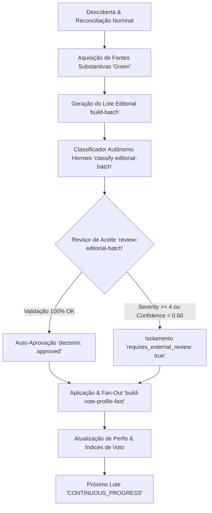

# Workflow Autônomo Hermes — Auto-Aprovação Contínua & Análise de Assessments (RS 2026)

**Versão:** 1.0.0  
**Data:** 2026-08-27  
**Projeto:** Portal Transparência Eleitoral RS (`eleicao2026` / *Voto Pra Quem?*)  
**Módulo:** Hermes Control Plane & Metodologia de Impacto Populacional `1.0`  

---

## 1. Visão Geral do Novo Modo do Workflow

O **Ciclo Editorial Autônomo do Hermes** foi desenhado para operar em modo contínuo e ininterrupto (`CONTINUOUS_PROGRESS`), eliminando paradas manuais ou bloqueios em cascata durante a esteira de análise de matérias legislativas e cálculo de alinhamento eleitoral.

### Princípios Fundamentais:
1. **Matéria uma vez, Fan-Out depois**: A unidade editorial é a `proposition_version` votada. A análise é realizada uma única vez por proposição e seus efeitos são distribuídos (*fan-out*) automaticamente para todos os parlamentares que registraram voto nominal no evento legislativo oficial.
2. **Auto-Aprovação Determinística**: Matérias que atendem aos critérios de integridade da Metodologia v1 são classificadas, validadas e auto-aprovadas diretamente pelo agente revisor, permitindo que a esteira continue sem pausas.
3. **Isolamento Granular de Blockers**: Quando uma proposição possui alta severidade (`severity >= 4`) ou incerteza estatística (`confidence < 0.60`), ela é isolada com `requires_external_review: true` para apreciação em painel externo, **sem travar** o lote nem as demais proposições do pipeline.
4. **Neutralidade e Fidelidade Factual**: O revisor classifica o efeito documentado da matéria na lei, sem emitir juízo de valor, ranking eleitoral ou rotulagem moral sobre parlamentares.
5. **Uma Única Matriz Canônica para Todos os Agentes**: Todos os executores (Hermes, Codex MCP, Google Antigravity, OpenCode, DeepSeek) compartilham estritamente a mesma Matriz de Impacto Populacional v1 (`impact-matrix-v1.schema.json`), os mesmos 14 grupos canônicos e o mesmo catálogo de avaliações. É proibida a criação de matrizes paralelas, por casa ou por candidato.

---

## 2. Diagrama de Fluxo do Ciclo Autônomo

---

## 3. Análise dos Assessments de Impacto Populacional

### 3.1. Taxonomia Fechada dos 14 Grupos Canônicos (Metodologia v1)
A taxonomia é estrita e fechada; é vedada a criação de grupos genéricos (como "geral" ou "população total"):

1. `povos_indigenas`
2. `comunidades_quilombolas`
3. `populacao_negra_periferica`
4. `mulheres`
5. `lgbtqia`
6. `pessoas_com_deficiencia`
7. `populacao_rua`
8. `populacao_carceraria`
9. `criancas_adolescentes_vulnerabilidade`
10. `pessoas_idosas_dependentes`
11. `trabalhadores_informais`
12. `agricultura_familiar_sem_terra`
13. `povos_de_terreiro`
14. `imigrantes_refugiados`

---

### 3.2. Disposições Editoriais (`disposition`)

| Disposição | Quando Utilizar | Payload de Assessment |
| :--- | :--- | :--- |
| **`assess`** | Texto normativo tem efeito substantivo direto e demonstrável sobre 1 ou mais dos 14 grupos canônicos. | `matrix` obrigatória + Array de `assessments` |
| **`no_direct_population_group`** | Efeito regulatório geral, tributário difuso, institucional ou orçamentário sem grupo destinatário específico. | `matrix: null`, `assessments: []` |
| **`taxonomy_gap`** | Há público humano específico e direto (ex: estudantes, servidores públicos, classe artística), mas fora dos 14 grupos v1. | `matrix: null`, `assessments: []` |
| **`excluded`** | Matéria ou evento estritamente regimental/procedimental (ex: preferência de votação, urgência, adiamento, retirada de pauta). | `matrix: null`, `assessments: []` |

---

### 3.3. Direção do Impacto (`impact_direction`) e Voto Defensor (`defending_vote`)

> **Regra Fundamental**: `SIM` e `NÃO` não possuem valor político intrínseco. O campo `defending_vote` responde a: *"Qual voto factual defenderia o interesse/direito documentado do grupo populacional?"*.

1. **Impacto Positivo (`impact_direction = 'positive'`):**
   - Amplia, protege, garante, financia ou salvaguarda direitos do grupo.
   - `defending_vote = 'sim'` (em matérias regulares).
2. **Impacto Negativo / Restritivo (`impact_direction = 'negative'`):**
   - Restringe, reduz, onera, desprotege ou enfraquece direitos do grupo.
   - **`defending_vote = 'nao'`**: O voto que defende o grupo populacional é votar **NÃO** contra a proposição prejudicial.
3. **Impacto Inconclusivo (`impact_direction = 'unclear'`):**
   - Incerteza fática material; `defending_vote = null` obrigatório.

---

### 3.4. Atributos da Matriz de Impacto

- **Severidade (`severity`)**:
  - `1`: Efeito limitado, localizado ou simbólico.
  - `2`: Efeito setorial de baixa magnitude.
  - `3`: Efeito material relevante ou orçamentário importante.
  - `4`: Efeito amplo sobre direitos fundamentais ou de difícil reversão *(aciona painel externo)*.
  - `5`: Mudança sistêmica ou constitucional duradoura *(aciona painel externo)*.
- **Tipo Estrutural (`structural_type`)**:
  - `structural`: Altera regras normativas, direitos ou estruturas legais (peso multiplicador **1.5**).
  - `budgetary`: Efeito principal via alocação orçamentária ou tributária (peso multiplicador **1.0**).
  - `symbolic`: Homenagens, datas comemorativas ou reconhecimentos simbólicos (peso multiplicador **0.5**).

---

## 4. Cálculo Determinístico de Alinhamento e Score

Após o assessment aprovado, o alinhamento de cada parlamentar é derivado puramente do cruzamento do seu voto nominal com o `defending_vote`:

### 4.1. Tabela de Sinais de Alinhamento

| Voto Nominal do Parlamentar | Comparação com `defending_vote` | Classificação de Alinhamento | Sinal Matemático ($s_i$) |
| :--- | :--- | :--- | :---: |
| **SIM** ou **NÃO** | Igual ao `defending_vote` | `a_favor` | **`+1`** |
| **SIM** ou **NÃO** | Diferente do `defending_vote` | `contra` | **`-1`** |
| **Abstenção** | Formalmente declarada | `neutro_declarado` | **`0`** |
| **Ausente** | Ausência com estratégia documentada | `omissao_estrategica` | **`-0.5`** |
| **Obstrução** | Obstrução parlamentar coordenada | `omissao_coordenada` | **`0`** |
| **Sem Dado / Não Avaliável** | Falta de registro ou voto não avaliável | `sem_dado` / `nao_avaliavel` | *Excluído* |

### 4.2. Fórmula de Agregação do Score

Para cada candidato $c$ e grupo populacional $g$:

$$\text{Score}(c, g) = \frac{\sum_{i \in \text{Votos Elegíveis}} \left( \text{Peso Estrutural}_i \times \text{Severidade}_i \times s_i \right)}{\sum_{i \in \text{Votos Elegíveis}} \left( \text{Peso Estrutural}_i \times \text{Severidade}_i \right)} \in [-1.0, +1.0]$$

---

## 5. Estrutura dos Scripts do Workflow Autônomo

| Script | Função no Workflow Autônomo |
| :--- | :--- |
| [`scripts/run-autonomous-editorial-cycle.mjs`](file:///home/lourenco/Projetos/eleicao2026/scripts/run-autonomous-editorial-cycle.mjs) | Maestro do ciclo contínuo ininterrupto do Hermes; executa descoberta, reconciliação, classificação, revisão e fan-out. |
| [`scripts/classify-editorial-batch.mjs`](file:///home/lourenco/Projetos/eleicao2026/scripts/classify-editorial-batch.mjs) | Classificador inteligente que analisa títulos, ementas e fontes substantivas, gerando matrizes, assessments e `defending_vote`. |
| [`scripts/review-editorial-batch.mjs`](file:///home/lourenco/Projetos/eleicao2026/scripts/review-editorial-batch.mjs) | Revisor de conformidade estrita que audita 100% dos critérios de aceite metodológicos e emite aprovação de lote. |
| [`scripts/apply-validated-editorial-batch.mjs`](file:///home/lourenco/Projetos/eleicao2026/scripts/apply-validated-editorial-batch.mjs) | Aplica disposições validadas no banco de dados via RPC transacional idempotente. |
| [`scripts/build-vote-profile-fast.mjs`](file:///home/lourenco/Projetos/eleicao2026/scripts/build-vote-profile-fast.mjs) | Materializador de alta velocidade que computa os índices nominais e perfis agregados para todos os candidatos elegíveis. |

---

## 6. Critérios de Aceite para Execução sem Interrupção

O lote é considerado 100% validado para auto-aprovação quando:
1. $\text{Erros de Validação} = 0$.
2. 100% dos itens aprovados possuem `source_gate === 'green'`.
3. 100% das disposições `assess` possuem `group_slug` em um dos 14 grupos canônicos.
4. 100% dos assessments positivos/negativos possuem `defending_vote` explícito (`sim` ou `nao`).
5. 100% das matérias de severidade $\ge 4$ ou confiança $< 0.60$ são marcadas com `requires_external_review: true`.
6. 0 votos nominais factuais foram modificados ou reinterpretados.
7. 0 matérias procedimentais herdaram mérito substantivo.
